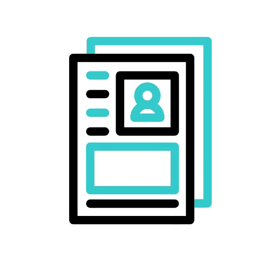

   

<h1 align="center">
  
    </h1>
<h3 align="center">Frontend Developer 🎨🖌️| Software Engineer 🌐🛠️| Backend Developer 👨‍💻</h3>

    

 <h3> Who Am I 🕵️‍♂️ ? </h3>

**`Hi, I'm Rick. I've been studying programming for about 8 months and I'm always looking to learn more about this ever-growing field. I'm currently pursuing a degree in Systems Analysis and Development (ADS) at Descomplica College, with the goal of improving my skills as a developer and gaining more professional experience to build a career in this field in the future.
`**

- 🌱 I’m currently learning **Golang, Spring Boot, and Hibernate Development**

- 📫 How to reach me **rickmarquesviana@gmail.com**

- ⚡ Fun fact **Always Want To Learn More 📚 .**

<h3 align="left">let's get in touch :</h3>

<!-- <h3 align="left">My Resume : </h3> -->

<h3 align="center" > 🚀 Languages - Frameworks - Tools - Libraries - Workspace 🚀</h3>

    

    

    

